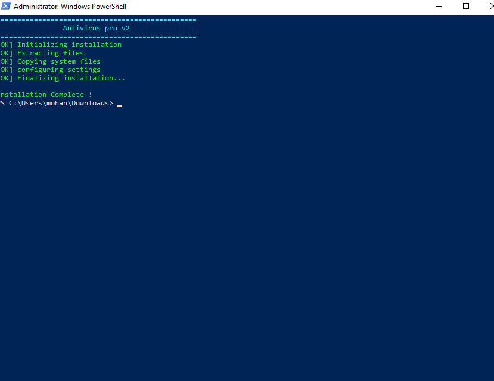
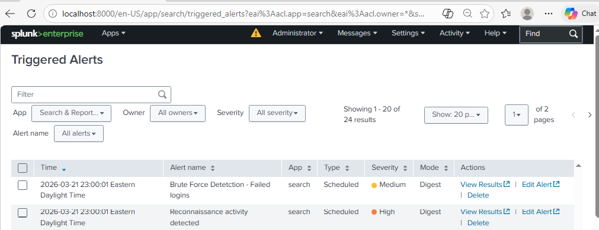
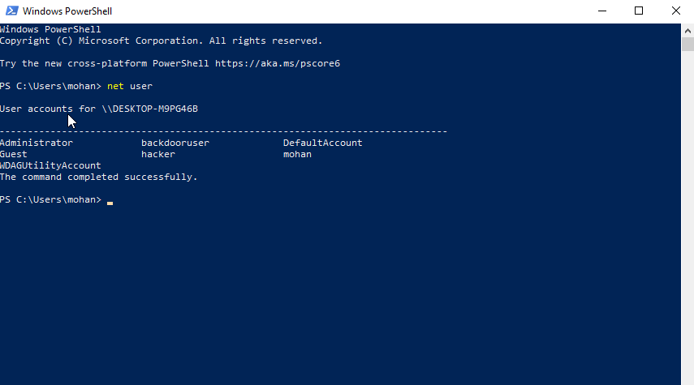
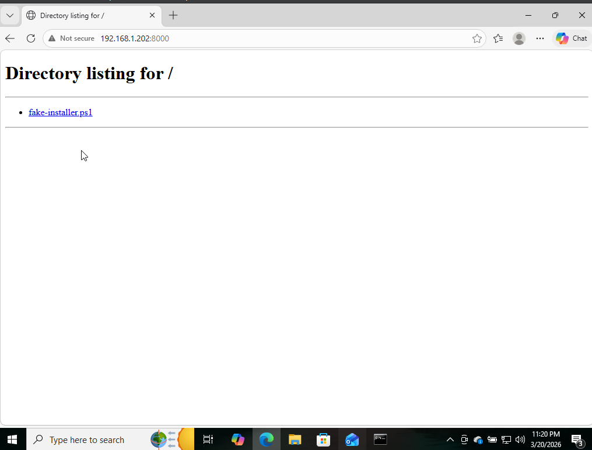

# ⚠️ Awareness Trojan Lab

> **EDUCATIONAL PURPOSE ONLY — Run ONLY in an isolated Virtual Machine. Never on real or production systems.**

A PowerShell script that simulates how a trojan works — disguised as a fake software installer, it silently runs brute force, persistence, and reconnaissance attacks in the background while showing a convincing fake UI to the user.

Built as Part 2 of my home SIEM lab project to demonstrate the full attack chain — from malware delivery to detection in Splunk.

📖 Read the full writeup on Medium → [How I Built a Home SIEM Lab with Splunk](https://medium.com/@mohankrishnaotikunta/how-i-built-a-home-siem-lab-with-splunk-and-everything-that-went-wrong-fd0ae7e98b52)

📖 Read the full writeup on Medium → [What Happens When You Click a Fake Installer? I Built One to Find Out](https://medium.com/@mohankrishnaotikunta/what-happens-when-you-click-a-fake-installer-i-built-one-to-find-out-0d8fc7cb5a98)

🔗 Part 1 — SIEM Detection Lab → [splunk-home-siem-lab](https://github.com/mohankrishnaotikunta/splunk-home-siem-lab)

---

## 🎭 How It Works

User runs fake-installer.ps1 thinking it's a software installer
                    ↓
     Fake "Antivirus Pro v2" installation UI appears
                    ↓
     Background (hidden from user):
     ├── Brute Force — 10 failed login attempts
     ├── Persistence — Creates backdoor user account
     └── Reconnaissance — whoami, ipconfig, netstat, systeminfo, tasklist
                    ↓
     Splunk detects all 3 attacks via Windows Event IDs


---

## 🖥️ Lab Environment

- **Hypervisor:** Oracle VirtualBox
- **OS:** Windows 10 Pro VM
- **SIEM:** Splunk Enterprise (Free License)
- **Delivery Method:** Python HTTP Server (simulating phishing link)
- **Language:** PowerShell

---

## ⚔️ Attacks Simulated

**Attack 1 — Brute Force 🔓**
Runs 10 failed login attempts against the Administrator account.
Generates **Event ID 4625** — Failed Login.

**Attack 2 — Persistence 👤**
Creates a backdoor user account with admin privileges.
Generates **Event ID 4720** — User Account Created.

**Attack 3 — Reconnaissance 🔍**
Runs whoami, ipconfig, netstat, systeminfo, tasklist silently.
Generates **Event ID 4688** — Process Creation.

---

## 🗺️ MITRE ATT&CK Mapping

Full mapping → [mitre-mapping.md](mitre-mapping.md)

| Attack | Event ID | Technique | ID |
|---|---|---|---|
| Brute Force | 4625 | Brute Force | T1110 |
| New User Created | 4720 | Create Account | T1136 |
| System Info Discovery | 4688 | System Information Discovery | T1082 |
| Process Discovery | 4688 | Process Discovery | T1057 |

---

## 🔍 Splunk Detection Rules

All SPL queries → [detections/splunk-rules.md](detections/splunk-rules.md)

---

## 📸 Screenshots

### Fake Installer Running


### Splunk Alerts Triggered


### Backdoor User Created


### File Delivery via Python HTTP Server


---

## 🚀 How to Run (VM Only)

1. Set up Splunk in Windows 10 VM → [see Part 1](https://github.com/mohankrishnaotikunta/splunk-home-siem-lab)
2. Transfer script to VM via Python HTTP server
3. In VM PowerShell as Administrator:
```powershell
Set-ExecutionPolicy Bypass -Scope CurrentUser
.\fake-installer.ps1
```
4. Watch Splunk detect all 3 attacks

---

## 🧹 Cleanup After Testing
```powershell
net user backdooruser /delete
Get-Job | Remove-Job
```

---

## 💡 Key Learnings

- Trojans disguise malicious activity behind legitimate-looking UI
- PowerShell background jobs (`Start-Job`) run attacks invisibly while foreground shows fake UI
- File delivery via HTTP server mirrors real phishing attack technique (MITRE T1566.002)
- All attack behaviors leave traces in Windows Event Logs — a SIEM catches everything

---

## 📚 References

- [MITRE ATT&CK Framework](https://attack.mitre.org)
- [Splunk Documentation](https://docs.splunk.com)
- [Windows Event ID Encyclopedia](https://www.ultimatewindowssecurity.com/securitylog/encyclopedia/)
